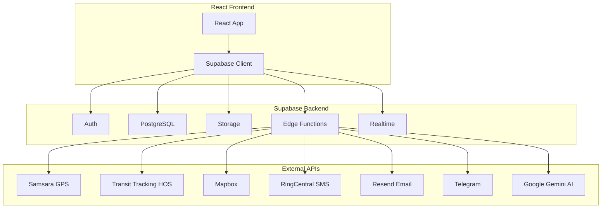
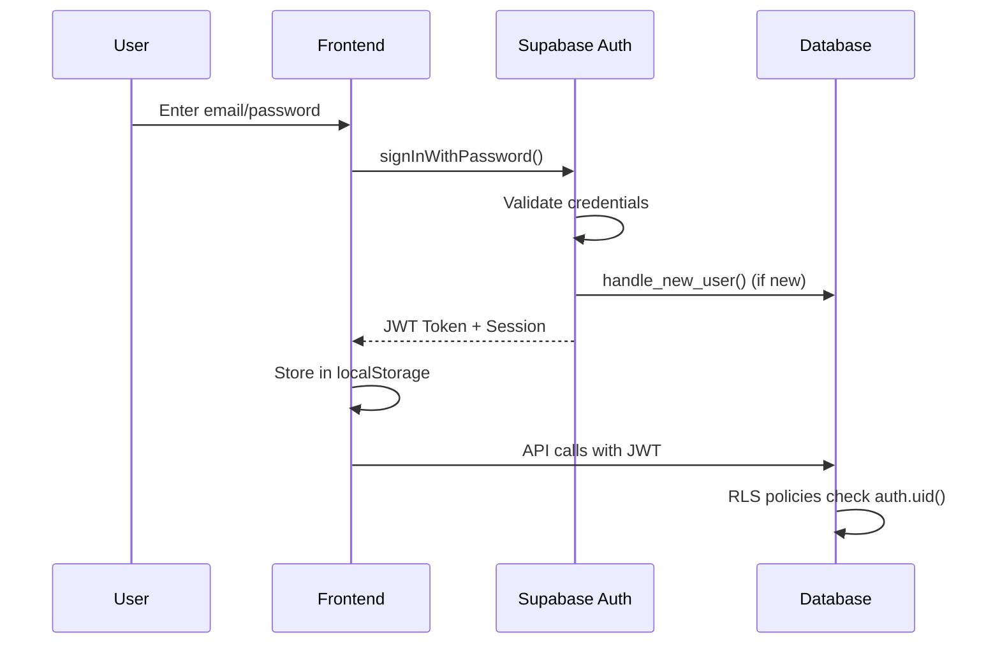
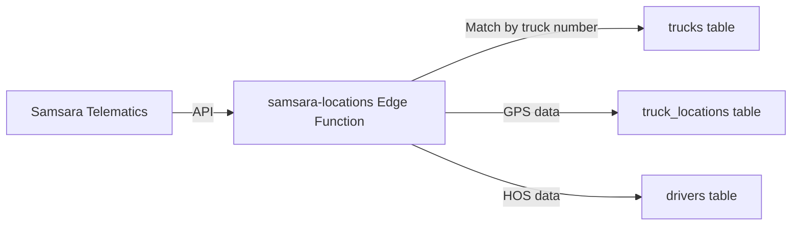
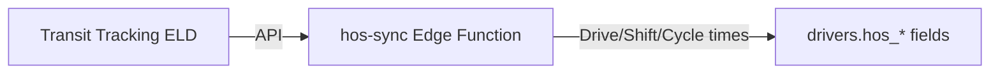
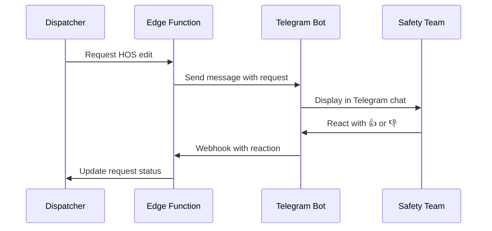
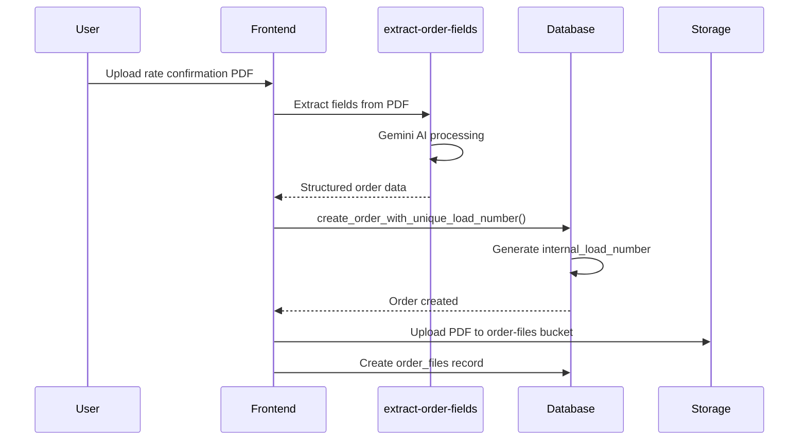
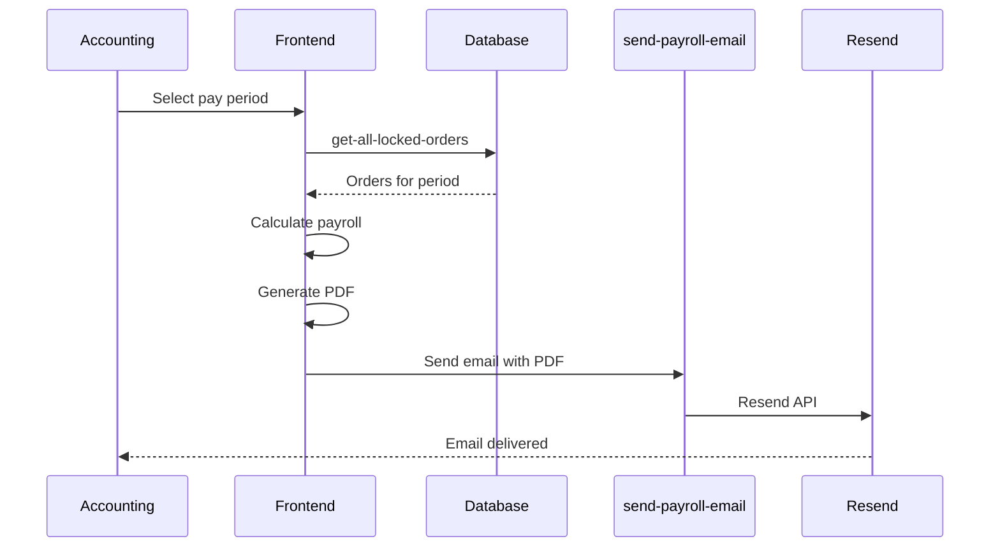

# BF Prime Dispatch - Backend Architecture

> Complete technical documentation of the Supabase-based backend infrastructure

## Table of Contents

1. [Architecture Overview](#1-architecture-overview)
2. [Database Schema](#2-database-schema)
3. [Database Functions & Triggers](#3-database-functions--triggers)
4. [Edge Functions](#4-edge-functions)
5. [Authentication & Authorization](#5-authentication--authorization)
6. [Storage Buckets](#6-storage-buckets)
7. [Real-time Subscriptions](#7-real-time-subscriptions)
8. [Security Configuration](#8-security-configuration)
9. [Third-Party Integrations](#9-third-party-integrations)

---

## 1. Architecture Overview

### Technology Stack

BF Prime Dispatch uses **Supabase** as its Backend-as-a-Service (BaaS), which provides:

| Component | Technology | Purpose |
|-----------|------------|---------|
| Database | PostgreSQL 15+ | Primary data store with JSONB, triggers, functions |
| Authentication | Supabase Auth | Email/password auth with JWT tokens |
| Storage | Supabase Storage | File uploads (PDFs, images, Excel files) |
| Serverless Functions | Deno Edge Functions | API integrations, AI processing, scheduled jobs |
| Real-time | Supabase Realtime | Live data updates via WebSocket channels |

### Connection Architecture



### Frontend Connection

The frontend connects via the official Supabase JS client:

```typescript
// src/integrations/supabase/client.ts
import { createClient } from '@supabase/supabase-js';

const supabaseUrl = "https://wjkbtagwgjniilmgwutb.supabase.co";
const supabaseAnonKey = "eyJhbGciOiJIUzI1NiIsInR5cCI6IkpXVCJ9...";

export const supabase = createClient(supabaseUrl, supabaseAnonKey);
```

**Project Details:**
- **Project ID:** `wjkbtagwgjniilmgwutb`
- **Region:** Supabase Cloud
- **API URL:** `https://wjkbtagwgjniilmgwutb.supabase.co`

---

## 2. Database Schema

The database contains 60+ tables organized by domain. Below is a comprehensive breakdown:

### Core Entities

#### `drivers`
Primary table for driver information including compliance tracking.

| Column | Type | Description |
|--------|------|-------------|
| `id` | UUID | Primary key |
| `first_name`, `last_name`, `name` | TEXT | Driver name fields |
| `phone`, `email` | TEXT | Contact information |
| `dispatcher_id` | UUID | Assigned dispatcher (FK to profiles) |
| `company_id` | UUID | Trucking company (FK to companies) |
| `is_active` | BOOLEAN | Active/terminated status |
| `is_company_driver` | BOOLEAN | Company vs lease operator |
| `is_recovery` | BOOLEAN | Recovery truck driver flag |
| `going_yard` | BOOLEAN | Heading to yard status |
| `hire_date` | DATE | Employment start date |
| `termination_date` | DATE | If terminated |
| `two_week_block_date` | DATE | 2-week notice date |
| `cents_per_mile` | NUMERIC | Pay rate (lease operators) |
| `weekly_payment` | NUMERIC | Weekly salary (company drivers) |
| `weeks_count` | INTEGER | Pay period weeks |
| **Compliance Fields** | | |
| `cdl_number`, `cdl_expiration_date` | TEXT/DATE | CDL information |
| `medical_card_expiration_date` | DATE | Medical certificate |
| `mvr_date` | DATE | Motor vehicle record date |
| `random_drug_test_date` | DATE | Last random drug test |
| `clearing_house` | TEXT | FMCSA Clearinghouse status |
| **HOS Fields (from Samsara)** | | |
| `hos_status` | TEXT | Current duty status |
| `hos_drive_minutes` | INTEGER | Available drive time |
| `hos_shift_minutes` | INTEGER | Available shift time |
| `hos_cycle_minutes` | INTEGER | Available cycle time |
| `hos_break_minutes` | INTEGER | Break time remaining |
| `hos_last_updated` | TIMESTAMPTZ | Last HOS sync time |
| **Home Location** | | |
| `home_address`, `home_city`, `home_state` | TEXT | Home address |
| `home_latitude`, `home_longitude` | NUMERIC | Geocoded coordinates |

#### `trucks`
Fleet vehicle inventory with driver assignments.

| Column | Type | Description |
|--------|------|-------------|
| `id` | UUID | Primary key |
| `truck_number` | TEXT | Unit number (e.g., "6GH5853") |
| `vin` | TEXT | Vehicle identification |
| `model` | TEXT | Make/model |
| `truck_type` | TEXT | Vehicle type |
| `ipass` | TEXT | Toll transponder ID |
| `status` | TEXT | active/inactive/shop |
| `company_id` | UUID | Owning company |
| `dispatcher_id` | UUID | Assigned dispatcher |
| `driver1_id` | UUID | Primary driver |
| `driver2_id` | UUID | Team driver (if applicable) |
| `trailer_id` | UUID | Currently attached trailer |
| **Compliance Dates** | | |
| `dot_inspection_date` | DATE | Annual inspection |
| `plate_expiration_date` | DATE | Registration |
| `insurance_expiration_date` | DATE | Insurance policy |

#### `trailers`
Trailer inventory and status tracking.

| Column | Type | Description |
|--------|------|-------------|
| `id` | UUID | Primary key |
| `trailer_number` | TEXT | Unit number |
| `vin` | TEXT | Vehicle identification |
| `trailer_type` | TEXT | dry van/reefer/flatbed |
| `capacity` | INTEGER | Weight capacity |
| `status` | TEXT | available/in-use/shop |
| `dot_inspection_date` | DATE | Annual inspection |
| `plate_expiration_date` | DATE | Registration |
| `insurance_expiration_date` | DATE | Insurance policy |

#### `orders`
Load/shipment records - the core business entity.

| Column | Type | Description |
|--------|------|-------------|
| `id` | UUID | Primary key |
| `load_number` | TEXT | Display load number |
| `internal_load_number` | INTEGER | Auto-incrementing per company |
| `broker_load_number` | TEXT | Broker's reference number |
| `company_id` | UUID | Truck's company |
| `booked_by_company_id` | UUID | Booking company (cross-booking) |
| `broker_id` | UUID | Freight broker |
| `truck_id` | UUID | Assigned truck |
| `trailer_id` | UUID | Assigned trailer |
| `driver1_id`, `driver2_id` | UUID | Assigned drivers |
| **Schedule** | | |
| `pickup_datetime` | TIMESTAMPTZ | Pickup appointment |
| `pickup_end_datetime` | TIMESTAMPTZ | Pickup window end |
| `delivery_datetime` | TIMESTAMPTZ | Delivery appointment |
| `delivery_end_datetime` | TIMESTAMPTZ | Delivery window end |
| `original_delivery_datetime` | TIMESTAMPTZ | Original (pre-reschedule) |
| **Financials** | | |
| `freight_amount` | NUMERIC | Gross revenue |
| `driver_price` | NUMERIC | Driver pay |
| `tonu` | NUMERIC | Truck order not used fee |
| `tonu_driver` | NUMERIC | TONU driver pay |
| `lumper_fee` | NUMERIC | Lumper charges |
| `lumper_paid_by` | TEXT | Who paid lumper |
| `detention_amount` | NUMERIC | Detention charges |
| **Mileage** | | |
| `loaded_miles` | INTEGER | Revenue miles |
| `dh_miles` | INTEGER | Deadhead miles |
| `mileage` | INTEGER | Total calculated miles |
| **Status Flags** | | |
| `is_locked` | BOOLEAN | Week locked for payroll |
| `is_canceled` | BOOLEAN | Canceled load |
| `is_tonu` | BOOLEAN | TONU flag |
| `is_invoiced` | BOOLEAN | Invoice sent |
| `is_paid` | BOOLEAN | Payment received |
| `needs_revised_rc` | BOOLEAN | Needs updated rate con |
| `has_problem` | BOOLEAN | Problem flag |
| **Timestamps** | | |
| `booked_by` | TEXT | Who booked the load |
| `created_at`, `updated_at` | TIMESTAMPTZ | Audit timestamps |

#### `pickup_drops`
Multi-stop locations per order.

| Column | Type | Description |
|--------|------|-------------|
| `id` | UUID | Primary key |
| `order_id` | UUID | Parent order |
| `stop_type` | TEXT | pickup/drop |
| `sequence` | INTEGER | Stop order (1, 2, 3...) |
| `facility_name` | TEXT | Location name |
| `address` | TEXT | Full address |
| `city`, `state`, `zip` | TEXT | Address components |
| `latitude`, `longitude` | NUMERIC | Geocoded coordinates |
| `appointment_datetime` | TIMESTAMPTZ | Scheduled time |
| `appointment_end_datetime` | TIMESTAMPTZ | Window end |
| `actual_arrival` | TIMESTAMPTZ | Check-in time |
| `actual_departure` | TIMESTAMPTZ | Check-out time |
| `reference_numbers` | TEXT | PO/reference numbers |
| `notes` | TEXT | Stop-specific notes |

#### `companies`
Trucking company entities.

| Column | Type | Description |
|--------|------|-------------|
| `id` | UUID | Primary key |
| `name` | TEXT | Company name |

**Known Companies:**
- BF Prime
- BF Prime United
- BG Inc
- Beverly Freight

#### `brokers`
Freight broker directory.

| Column | Type | Description |
|--------|------|-------------|
| `id` | UUID | Primary key |
| `name` | TEXT | Broker name |
| `mc_number` | TEXT | MC/DOT number |
| `address` | TEXT | Billing address |

### User & Auth Tables

#### `profiles`
User profile data linked to Supabase Auth.

| Column | Type | Description |
|--------|------|-------------|
| `id` | UUID | Primary key |
| `user_id` | UUID | FK to auth.users |
| `email` | TEXT | User email |
| `full_name` | TEXT | Display name |
| `avatar_url` | TEXT | Profile picture |
| `office` | TEXT | Office assignment (Chicago/Florida) |
| `hire_date` | DATE | Employment date |
| `phone` | TEXT | Phone number |

#### `user_roles`
Role-based access control (RBAC).

| Column | Type | Description |
|--------|------|-------------|
| `id` | UUID | Primary key |
| `user_id` | UUID | FK to auth.users |
| `role` | app_role | Role enum |

**Available Roles (`app_role` enum):**
- `admin` - Full system access
- `manager` - Management functions
- `supervisor` - Team supervision
- `dispatch` - Standard dispatcher
- `accounting` - Financial access
- `safety` - Compliance management
- `driver` - Driver portal (limited)
- `recovery` - Recovery operations
- `afterhours` - After-hours dispatch
- `moderator` - Content moderation
- `viewer` - Read-only access

### Operations Tables

#### `order_transfers`
Load handoffs between drivers.

| Column | Type | Description |
|--------|------|-------------|
| `id` | UUID | Primary key |
| `order_id` | UUID | Order being transferred |
| `from_driver_id` | UUID | Original driver |
| `to_driver_id` | UUID | Receiving driver |
| `from_truck_id` | UUID | Original truck |
| `to_truck_id` | UUID | Receiving truck |
| `transfer_location` | TEXT | Handoff location |
| `transfer_datetime` | TIMESTAMPTZ | Scheduled time |
| `reason` | TEXT | Transfer reason |

#### `order_files`
Document attachments for orders.

| Column | Type | Description |
|--------|------|-------------|
| `id` | UUID | Primary key |
| `order_id` | UUID | Parent order |
| `file_type` | TEXT | rc/bol/pod/invoice/other |
| `file_path` | TEXT | Storage path |
| `file_name` | TEXT | Original filename |
| `uploaded_by` | UUID | Uploader |

#### `recovery_history`
Breakdown/recovery operations.

| Column | Type | Description |
|--------|------|-------------|
| `id` | UUID | Primary key |
| `truck_id` | UUID | Broken down truck |
| `recovery_truck_id` | UUID | Recovery vehicle |
| `driver_id` | UUID | Recovery driver |
| `location` | TEXT | Breakdown location |
| `issue_type` | TEXT | mechanical/tire/accident |
| `status` | TEXT | pending/dispatched/completed |

### Analytics & Tracking Tables

#### `daily_driver_stats`
Historical daily records for lost days and home time.

| Column | Type | Description |
|--------|------|-------------|
| `id` | UUID | Primary key |
| `date` | DATE | Record date |
| `driver_id` | UUID | Driver |
| `dispatcher_id` | UUID | Assigned dispatcher |
| `office` | TEXT | Office |
| `has_lost_day` | BOOLEAN | Lost day flag |
| `has_home_time` | BOOLEAN | Home time flag |
| `has_reschedule` | BOOLEAN | Reschedule flag |
| `lost_day_note` | TEXT | Reason/notes |
| `reschedule_order_id` | UUID | Rescheduled order |

#### `dispatcher_daily_driver_counts`
Daily snapshots of fleet size per dispatcher.

| Column | Type | Description |
|--------|------|-------------|
| `id` | UUID | Primary key |
| `date` | DATE | Record date |
| `dispatcher_id` | UUID | Dispatcher |
| `truck_count` | INTEGER | Number of trucks |
| `driver_count` | INTEGER | Number of drivers |

#### `analytics_dispatcher_period`
Aggregated performance metrics.

| Column | Type | Description |
|--------|------|-------------|
| `id` | UUID | Primary key |
| `dispatcher_id` | UUID | Dispatcher |
| `dispatcher_name` | TEXT | Name |
| `period_type` | TEXT | weekly/monthly |
| `period_start`, `period_end` | DATE | Period range |
| `total_freight` | NUMERIC | Gross revenue |
| `total_miles` | INTEGER | Total miles |
| `total_driver_rate` | NUMERIC | Total driver pay |
| `dispatcher_cut` | NUMERIC | Company profit |
| `dispatcher_cut_percent` | NUMERIC | Margin % |
| `order_count` | INTEGER | Number of loads |
| `avg_trucks` | NUMERIC | Average truck count |
| `rate_per_mile` | NUMERIC | $/mile |

#### `truck_locations`
GPS positions from Samsara telematics.

| Column | Type | Description |
|--------|------|-------------|
| `id` | UUID | Primary key |
| `truck_id` | UUID | Truck |
| `truck_number` | TEXT | Unit number |
| `latitude`, `longitude` | NUMERIC | Coordinates |
| `location_timestamp` | TIMESTAMPTZ | Position time |
| `samsara_vehicle_id` | TEXT | Samsara ID |
| `samsara_vehicle_name` | TEXT | Samsara name |
| `speed` | NUMERIC | MPH |
| `heading` | NUMERIC | Direction degrees |

### Financial Tables

#### `driver_expenses`
Driver deductions and debts.

| Column | Type | Description |
|--------|------|-------------|
| `id` | UUID | Primary key |
| `driver_id` | UUID | Driver |
| `name` | TEXT | Expense name |
| `amount` | NUMERIC | Amount owed |
| `explanation` | TEXT | Description |
| `expense_date` | DATE | Date incurred |
| `status` | TEXT | pending/paid/partial |
| `is_fixed` | BOOLEAN | Fixed weekly deduction |
| `paid_amount` | NUMERIC | Amount paid |
| `paid_date` | DATE | Payment date |
| `truck_number`, `trailer_number` | TEXT | Related equipment |
| `repair_id` | UUID | Linked repair |
| `cash_advance_id` | UUID | Linked cash advance |

#### `driver_cash_advances`
Cash advance requests.

| Column | Type | Description |
|--------|------|-------------|
| `id` | UUID | Primary key |
| `driver_id` | UUID | Driver |
| `amount` | NUMERIC | Requested amount |
| `truck_number` | TEXT | Current truck |
| `requested_at` | TIMESTAMPTZ | Request time |
| `requested_by` | UUID | Dispatcher who requested |

#### `fuel_transactions`
EFS fuel card transaction data.

| Column | Type | Description |
|--------|------|-------------|
| `id` | UUID | Primary key |
| `transaction_id` | TEXT | EFS transaction ID |
| `driver_id` | UUID | Driver |
| `truck_id` | UUID | Truck |
| `transaction_date` | TIMESTAMPTZ | Transaction time |
| `location` | TEXT | Fuel stop |
| `fuel_amount` | NUMERIC | Gallons |
| `fuel_cost` | NUMERIC | Fuel cost |
| `def_amount` | NUMERIC | DEF gallons |
| `def_cost` | NUMERIC | DEF cost |
| `cash_advance` | NUMERIC | Cash advance |
| `total` | NUMERIC | Total amount |

#### `repairs`
Equipment repair records.

| Column | Type | Description |
|--------|------|-------------|
| `id` | UUID | Primary key |
| `truck_id` | UUID | Truck (optional) |
| `trailer_id` | UUID | Trailer (optional) |
| `driver_id` | UUID | Driver responsible |
| `repair_type` | TEXT | Type of repair |
| `description` | TEXT | Details |
| `cost` | NUMERIC | Repair cost |
| `vendor` | TEXT | Repair shop |
| `repair_date` | DATE | Service date |
| `status` | TEXT | pending/completed |
| `is_driver_fault` | BOOLEAN | Driver liability |

#### `dispatcher_salary_payments`
Dispatcher payroll records.

| Column | Type | Description |
|--------|------|-------------|
| `id` | UUID | Primary key |
| `user_id` | UUID | Dispatcher |
| `month` | TEXT | Pay period (YYYY-MM) |
| `calculated_salary` | NUMERIC | Calculated amount |
| `paid_amount` | NUMERIC | Actual payment |
| `paid_at` | TIMESTAMPTZ | Payment date |
| `paid_by` | UUID | Accounting user |

### Compliance & Safety Tables

#### `driver_drug_tests`
Drug test records.

| Column | Type | Description |
|--------|------|-------------|
| `id` | UUID | Primary key |
| `driver_id` | UUID | Driver |
| `result` | TEXT | positive/negative/pending |
| `tested_by` | UUID | Administering user |
| `created_at` | TIMESTAMPTZ | Test date |

#### `hos_requests`
Hours of Service edit requests.

| Column | Type | Description |
|--------|------|-------------|
| `id` | UUID | Primary key |
| `driver_id` | UUID | Driver |
| `truck_id` | UUID | Truck |
| `request_type` | TEXT | Type of request |
| `reason` | TEXT | Justification |
| `status` | TEXT | pending/approved/denied |
| `requested_by` | UUID | Dispatcher |
| `approved_by` | UUID | Safety manager |

#### `driver_pii_audit_log`
Audit trail for sensitive data access.

| Column | Type | Description |
|--------|------|-------------|
| `id` | UUID | Primary key |
| `driver_id` | UUID | Driver whose data was accessed |
| `accessed_by` | UUID | User who accessed |
| `operation` | TEXT | SELECT/INSERT/UPDATE/DELETE |
| `fields_accessed` | TEXT[] | Which fields were viewed |
| `access_reason` | TEXT | Justification |
| `accessed_at` | TIMESTAMPTZ | Timestamp |
| `ip_address` | INET | Client IP |
| `user_agent` | TEXT | Browser/client info |

#### `driver_sensitive_pii`
Sensitive driver data (separate table for security).

| Column | Type | Description |
|--------|------|-------------|
| `id` | UUID | Primary key |
| `driver_id` | UUID | Driver (unique) |
| `ssn` | TEXT | Social Security Number |
| `fein` | TEXT | Federal Employer ID |
| `fuel_card_number` | TEXT | EFS card number |
| `personal_id` | TEXT | ID document number |

### Additional Operational Tables

#### `driver_yard_actions`
Yard arrival/departure tracking.

| Column | Type | Description |
|--------|------|-------------|
| `id` | UUID | Primary key |
| `driver_id` | UUID | Driver |
| `action_type` | TEXT | arriving/departing |
| `arrival_datetime` | TIMESTAMPTZ | Expected time |
| `comment` | TEXT | Notes |
| `is_team` | BOOLEAN | Team driver flag |
| `is_checked` | BOOLEAN | Checked in/out |
| `truck_number` | TEXT | Truck |

#### `weekly_plans`
Weekly driver planning.

| Column | Type | Description |
|--------|------|-------------|
| `id` | UUID | Primary key |
| `driver_id` | UUID | Driver |
| `week_start` | DATE | Week start date |
| `plan_type` | TEXT | working/home/off |
| `notes` | TEXT | Notes |
| `dispatcher_id` | UUID | Planner |
| `is_admin_unlocked` | BOOLEAN | Admin override lock |
| `unlocked_by` | UUID | Who unlocked |
| `unlocked_at` | TIMESTAMPTZ | When unlocked |

#### `driver_problems`
Driver issues/incidents.

| Column | Type | Description |
|--------|------|-------------|
| `id` | UUID | Primary key |
| `driver_id` | UUID | Driver |
| `reason` | TEXT | Issue description |
| `status` | TEXT | open/resolved |
| `dispatcher_name` | TEXT | Reporting dispatcher |
| `truck_number` | TEXT | Related truck |
| `resolved_at` | TIMESTAMPTZ | Resolution time |
| `resolved_by` | UUID | Resolver |

#### `assignment_history`
Audit trail for truck/driver assignments.

| Column | Type | Description |
|--------|------|-------------|
| `id` | UUID | Primary key |
| `truck_id`, `old_truck_id` | UUID | Current/previous truck |
| `trailer_id`, `old_trailer_id` | UUID | Current/previous trailer |
| `driver1_id`, `old_driver1_id` | UUID | Current/previous driver |
| `driver2_id`, `old_driver2_id` | UUID | Current/previous co-driver |
| `dispatcher_id`, `old_dispatcher_id` | UUID | Current/previous dispatcher |
| `change_type` | TEXT | Type of change |
| `reason` | TEXT | Change reason |
| `changed_at` | TIMESTAMPTZ | When changed |
| `changed_by` | UUID | Who changed |

---

## 3. Database Functions & Triggers

### Core Functions

#### `handle_new_user()`
**Trigger:** Runs on `auth.users` INSERT

Creates a profile and assigns default role when a new user signs up.

```sql
CREATE OR REPLACE FUNCTION public.handle_new_user()
RETURNS trigger
LANGUAGE plpgsql
SECURITY DEFINER
SET search_path TO 'public'
AS $$
DECLARE
  user_role app_role;
BEGIN
  -- Extract role from metadata, default to 'dispatch'
  user_role := COALESCE((NEW.raw_user_meta_data ->> 'role')::app_role, 'dispatch'::app_role);
  
  -- SECURITY: For self-signup, restrict to dispatch and driver roles only
  IF NOT NEW.email_confirmed_at IS NOT NULL AND user_role IN ('admin', 'manager', 'safety') THEN
    user_role := 'dispatch'::app_role;
  END IF;
  
  -- Insert into profiles
  INSERT INTO public.profiles (user_id, email, full_name)
  VALUES (NEW.id, NEW.email, COALESCE(NEW.raw_user_meta_data ->> 'full_name', NEW.email));
  
  -- Add to user_roles table
  INSERT INTO public.user_roles (user_id, role)
  VALUES (NEW.id, user_role);
  
  RETURN NEW;
END;
$$;
```

#### `has_role()`
Permission checking function used throughout the app.

```sql
CREATE OR REPLACE FUNCTION public.has_role(_user_id uuid, _role app_role)
RETURNS boolean
LANGUAGE sql
STABLE SECURITY DEFINER
SET search_path TO 'public'
AS $$
  SELECT EXISTS (
    SELECT 1
    FROM public.user_roles
    WHERE user_id = _user_id
      AND role = _role
  );
$$;
```

**Usage in RLS policies:**
```sql
-- Example: Only admins can delete orders
CREATE POLICY "Admins can delete orders"
  ON orders FOR DELETE
  USING (has_role(auth.uid(), 'admin'));
```

#### `create_order_with_unique_load_number()`
Atomic order creation with company-scoped auto-incrementing load numbers.

```sql
CREATE OR REPLACE FUNCTION public.create_order_with_unique_load_number(order_data jsonb)
RETURNS jsonb
LANGUAGE plpgsql
SECURITY DEFINER
SET search_path TO 'public'
AS $$
DECLARE
  next_load_number integer;
  new_order_id uuid;
  company_uuid uuid;
BEGIN
  company_uuid := (order_data->>'company_id')::uuid;
  
  -- Get next internal load number for this company
  SELECT COALESCE(MAX(internal_load_number), 0) + 1 
  INTO next_load_number
  FROM orders 
  WHERE company_id = company_uuid
    AND internal_load_number IS NOT NULL;
  
  -- Insert order with unique number
  INSERT INTO orders (
    internal_load_number,
    company_id,
    -- ... other fields from order_data
  ) VALUES (
    next_load_number,
    company_uuid,
    -- ...
  )
  RETURNING id INTO new_order_id;
  
  RETURN jsonb_build_object(
    'id', new_order_id,
    'internal_load_number', next_load_number
  );
END;
$$;
```

#### `get_assignment_history()`
Query function for the assignment audit trail.

```sql
CREATE OR REPLACE FUNCTION public.get_assignment_history(
  p_entity_type text,
  p_entity_id uuid,
  p_from_date timestamptz DEFAULT NULL,
  p_to_date timestamptz DEFAULT NULL,
  p_limit integer DEFAULT 100
)
RETURNS TABLE(
  id uuid,
  truck_id uuid,
  truck_number text,
  driver1_name text,
  -- ... other columns
)
LANGUAGE plpgsql
SECURITY DEFINER
AS $$
BEGIN
  RETURN QUERY
  SELECT ...
  FROM assignment_history ah
  LEFT JOIN trucks t ON t.id = ah.truck_id
  -- ... joins
  WHERE 
    CASE 
      WHEN p_entity_type = 'truck' THEN ah.truck_id = p_entity_id
      WHEN p_entity_type = 'driver' THEN ah.driver1_id = p_entity_id
      -- ...
    END
  ORDER BY ah.changed_at DESC
  LIMIT p_limit;
END;
$$;
```

### Audit Triggers

#### `log_truck_assignment_changes()`
**Trigger:** Runs on `trucks` UPDATE

Records changes to driver/trailer assignments.

```sql
CREATE OR REPLACE FUNCTION public.log_truck_assignment_changes()
RETURNS trigger
LANGUAGE plpgsql
SECURITY DEFINER
AS $$
BEGIN
  IF (OLD.driver1_id IS DISTINCT FROM NEW.driver1_id) 
     OR (OLD.driver2_id IS DISTINCT FROM NEW.driver2_id)
     OR (OLD.trailer_id IS DISTINCT FROM NEW.trailer_id) THEN
    
    INSERT INTO assignment_history (
      truck_id, trailer_id, driver1_id, driver2_id,
      old_truck_id, old_trailer_id, old_driver1_id, old_driver2_id,
      change_type, changed_at, changed_by
    ) VALUES (
      NEW.id, NEW.trailer_id, NEW.driver1_id, NEW.driver2_id,
      OLD.id, OLD.trailer_id, OLD.driver1_id, OLD.driver2_id,
      'assignment_change', now(), auth.uid()
    );
  END IF;
  
  RETURN NEW;
END;
$$;
```

#### `log_driver_dispatcher_changes()`
**Trigger:** Runs on `drivers` UPDATE

Tracks dispatcher reassignments.

#### `capture_original_delivery_datetime()`
**Trigger:** Runs on `orders` UPDATE

Preserves original delivery time when rescheduled.

```sql
CREATE OR REPLACE FUNCTION public.capture_original_delivery_datetime()
RETURNS trigger
LANGUAGE plpgsql
AS $$
BEGIN
  IF OLD.delivery_datetime IS DISTINCT FROM NEW.delivery_datetime 
     AND NEW.original_delivery_datetime IS NULL 
     AND OLD.delivery_datetime IS NOT NULL THEN
    NEW.original_delivery_datetime := OLD.delivery_datetime;
  END IF;
  RETURN NEW;
END;
$$;
```

#### `save_truck_note_history()`
Maintains version history for truck notes (last 7 versions).

#### `log_driver_pii_access()`
Audit logging for sensitive PII access.

### Helper Functions

#### `log_pii_view()`
Application-callable function to log PII access.

```sql
CREATE OR REPLACE FUNCTION public.log_pii_view(
  p_driver_id uuid, 
  p_fields_accessed text[], 
  p_reason text DEFAULT NULL
)
RETURNS void
LANGUAGE plpgsql
SECURITY DEFINER
AS $$
BEGIN
  INSERT INTO driver_pii_audit_log (
    driver_id, accessed_by, operation, fields_accessed, access_reason
  ) VALUES (
    p_driver_id, auth.uid(), 'SELECT', p_fields_accessed, p_reason
  );
END;
$$;
```

#### `sign_out_all_users()`
Admin function to force-logout all users.

```sql
CREATE OR REPLACE FUNCTION public.sign_out_all_users()
RETURNS jsonb
LANGUAGE plpgsql
SECURITY DEFINER
SET search_path TO 'auth', 'pg_temp'
AS $$
DECLARE
  sessions_deleted integer;
  tokens_deleted integer;
BEGIN
  DELETE FROM auth.refresh_tokens;
  GET DIAGNOSTICS tokens_deleted = ROW_COUNT;
  
  DELETE FROM auth.sessions;
  GET DIAGNOSTICS sessions_deleted = ROW_COUNT;
  
  RETURN jsonb_build_object(
    'sessions_deleted', sessions_deleted,
    'tokens_deleted', tokens_deleted
  );
END;
$$;
```

---

## 4. Edge Functions

All edge functions are located in `supabase/functions/` and deployed automatically. They run on Deno Deploy.

### Configuration

Edge function settings are in `supabase/config.toml`:

```toml
project_id = "wjkbtagwgjniilmgwutb"

[functions.hello-world]
verify_jwt = false

[functions.send-efs-request]
verify_jwt = false

# ... other functions
```

**Note:** Most functions have `verify_jwt = false` because they handle auth internally or are public endpoints.

### AI/Document Processing

#### `extract-order-fields`
Uses Google Gemini AI to extract structured data from rate confirmation PDFs.

**Input:**
```json
{
  "pdfBase64": "base64-encoded-pdf-content"
}
```

**Output:**
```json
{
  "broker_name": "ABC Logistics",
  "broker_load_number": "12345",
  "pickup_address": "123 Main St, Chicago, IL",
  "delivery_address": "456 Oak Ave, Dallas, TX",
  "pickup_datetime": "2024-01-15T08:00:00",
  "delivery_datetime": "2024-01-16T14:00:00",
  "freight_amount": 2500.00,
  "loaded_miles": 850
}
```

**Dependencies:** `GEMINI_API_KEY`

#### `generate-load-confirmation`
Generates PDF load sheets for drivers using pdf-lib.

**Input:**
```json
{
  "orderId": "uuid",
  "templateType": "1p2d" // 1 pickup, 2 drops
}
```

**Output:** Base64-encoded PDF

### External Integrations

#### `samsara-locations`
Fetches real-time GPS positions from Samsara telematics.

**Process:**
1. Fetches vehicles from both Samsara API keys (two accounts)
2. Matches vehicles to trucks by truck number pattern
3. Updates `truck_locations` table
4. Updates driver HOS data

**Dependencies:** `SAMSARA_API_KEY_1`, `SAMSARA_API_KEY_2`

**Endpoint:** `https://api.samsara.com/fleet/vehicles`

#### `hos-sync`
Syncs Hours of Service data from Transit Tracking ELD API.

**Process:**
1. Fetches HOS status for each driver
2. Parses drive/shift/cycle/break remaining times
3. Updates `drivers` table with HOS fields

**Dependencies:** `TRANSIT_TRACKING_API_KEYS`

#### `calculate-mapbox-route`
Calculates driving distance and duration using Mapbox Directions API.

**Input:**
```json
{
  "coordinates": [
    [-87.6298, 41.8781],  // Chicago
    [-96.7970, 32.7767]   // Dallas
  ]
}
```

**Output:**
```json
{
  "distance": 920,  // miles
  "duration": 52200  // seconds
}
```

**Dependencies:** `MAPBOX_PUBLIC_TOKEN`

#### `geocode-address`
Converts addresses to coordinates using OpenStreetMap Nominatim (free).

**Input:**
```json
{
  "address": "123 Main St, Chicago, IL 60601"
}
```

**Output:**
```json
{
  "success": true,
  "latitude": 41.8781,
  "longitude": -87.6298
}
```

### Communication Functions

#### `send-sms`
Sends SMS messages via RingCentral.

**Input:**
```json
{
  "to": "+13125551234",
  "message": "Your load is ready for pickup"
}
```

**Dependencies:** 
- `RINGCENTRAL_CLIENT_ID`
- `RINGCENTRAL_CLIENT_SECRET`
- `RINGCENTRAL_JWT_TOKEN`
- `RINGCENTRAL_PHONE_NUMBER`

#### `send-payroll-email`
Sends payroll statement PDFs via Resend.

**Input:**
```json
{
  "recipientEmail": "dispatcher@example.com",
  "dispatcherName": "John Smith",
  "payPeriod": "January 1-15, 2024",
  "pdfBytes": [/* byte array */]
}
```

**Dependencies:** `RESEND_API_KEY`

**Sender:** `statements@beverlyfreight.net`

#### `send-efs-request`
Sends EFS fuel card requests to Telegram.

**Input:**
```json
{
  "driverName": "John Smith",
  "truckNumber": "6GH5853",
  "amount": 500,
  "location": "TA Truck Stop, Gary, IN"
}
```

**Dependencies:** `TELEGRAM_BOT_TOKEN`, `TELEGRAM_CHAT_ID`

#### `send-cash-advance-request`
Sends cash advance requests to Telegram.

#### `send-hos-request`
Sends HOS edit requests to Telegram for safety team approval.

#### `telegram-webhook` / `setup-telegram-webhook`
Handles incoming Telegram messages and reactions (for HOS approvals).

#### `send-load-confirmation-email`
Emails load sheets to drivers.

#### `send-password-reset`
Custom password reset flow.

#### `send-late-notification`
Notifies dispatchers of late deliveries.

### User Management

#### `create-user`
Admin function to create new users.

**Input:**
```json
{
  "email": "new.user@example.com",
  "password": "tempPassword123",
  "fullName": "New User",
  "role": "dispatch"
}
```

**Process:**
1. Creates auth.users entry via Admin API
2. Profile and role created by `handle_new_user()` trigger

**Dependencies:** `SUPABASE_SERVICE_ROLE_KEY`

#### `delete-user`
Removes a user from the system.

#### `update-user-role`
Changes a user's role.

#### `logout-all-users`
Force sign-out all users (calls `sign_out_all_users()` function).

### Scheduled Jobs (CRON)

These functions are called by external CRON services using the `CRON_SECRET`.

#### `record-daily-driver-stats`
**Schedule:** Daily at midnight CT

Records lost days and home time for all drivers.

**Process:**
1. Gets all active drivers with dispatchers
2. Checks if driver has any loads for the day
3. Checks for home time (near home address)
4. Inserts `daily_driver_stats` records

#### `record-dispatcher-driver-counts`
**Schedule:** Daily

Snapshots truck/driver counts per dispatcher for analytics.

#### `cleanup-yard-arrivals`
**Schedule:** Daily

Housekeeping for yard arrival records.

#### `clear-weekly-plans`
**Schedule:** Weekly (Sunday)

Resets weekly plan lock status for new week.

#### `check-delivery-etas`
**Schedule:** Hourly

Compares current truck positions to delivery ETAs, flags late loads.

#### `process-afterhours-schedule`
**Schedule:** Daily at 5pm CT

Notifies after-hours dispatchers of their shift.

### Data Operations

#### `search-orders`
Advanced order search with full-text search and pagination.

**Input:**
```json
{
  "query": "ABC123",
  "filters": {
    "dateFrom": "2024-01-01",
    "dateTo": "2024-01-31",
    "dispatcherId": "uuid",
    "status": "delivered"
  },
  "page": 1,
  "pageSize": 50
}
```

#### `get-all-unlocked-orders` / `get-all-locked-orders`
Bulk retrieval for reports and payroll.

#### `calculate-distances-batch`
Batch mileage calculations for multiple origin-destination pairs.

#### `recalculate-load-miles`
Recalculates mileage for an order based on stops.

#### `merge-pdfs`
Combines invoice PDF with attachment files (RC, BOL, POD, Additional). Handles PNG→JPEG conversion with downscaling to stay within Deno's 150MB memory limit. Returns machine-readable skip reasons (`storage_missing`, `download_timeout`, `download_failed`) and supports PDF attachment fallback for non-standard PDFs.

#### `create-invoice-folder` *(deprecated)*
Legacy server-side ZIP builder. Not called by the frontend — invoicing uses client-side ZIP assembly with `merge-pdfs` for attachments. Retained for potential external callers.

---

## 5. Authentication & Authorization

### Authentication Flow



### Role-Based Access Control (RBAC)

#### Role Hierarchy

```
admin
  └── manager
       └── supervisor
            └── dispatch
                 └── driver
```

#### Role Permissions

| Role | Description | Key Permissions |
|------|-------------|-----------------|
| `admin` | Full system access | All operations, user management, system config |
| `manager` | Management functions | View all data, modify assignments, analytics |
| `supervisor` | Team supervision | View team data, approve requests |
| `dispatch` | Standard dispatcher | Own drivers/trucks, create orders |
| `accounting` | Financial access | Payroll, invoicing, expenses |
| `safety` | Compliance management | Drug tests, HOS approvals, compliance |
| `driver` | Driver portal | View own loads, limited access |
| `recovery` | Recovery operations | Recovery dispatch only |
| `afterhours` | After-hours dispatch | Limited dispatch during off-hours |
| `moderator` | Content moderation | Edit/delete content |
| `viewer` | Read-only access | View only, no modifications |

#### Frontend Permission Checks

```typescript
// src/contexts/AuthContext.tsx
export const useAuth = () => {
  const { user, userRoles } = useContext(AuthContext);
  
  const hasRole = (role: string) => userRoles.includes(role);
  
  const canEdit = hasRole('admin') || hasRole('manager') || hasRole('dispatch');
  const canDelete = hasRole('admin');
  const canViewPII = hasRole('admin') || hasRole('manager') || hasRole('safety');
  
  return { user, hasRole, canEdit, canDelete, canViewPII };
};
```

### Service Role Key Usage

Edge functions use the service role key for admin operations:

```typescript
// In edge function
import { createClient } from '@supabase/supabase-js';

const supabase = createClient(
  Deno.env.get('SUPABASE_URL')!,
  Deno.env.get('SUPABASE_SERVICE_ROLE_KEY')!
);

// Bypasses RLS - use carefully!
const { data } = await supabase.from('users').select('*');
```

---

## 6. Storage Buckets

### Bucket Configuration

| Bucket | Public | Purpose |
|--------|--------|---------|
| `order-files` | No | Rate confirmations, BOLs, PODs, invoices |
| `driver-files` | No | Driver documents (CDL, medical card, etc.) |
| `truck-files` | No | Truck documents (registration, insurance) |
| `trailer-files` | No | Trailer documents |
| `efs-receipts` | No | Fuel receipts |
| `email-attachments` | Yes | Email assets (images, templates) |
| `archived-orders` | No | Historical order backups |
| `company-files` | No | Company documents |
| `Profilne` | No | PDF templates for load confirmations |

### File Upload Pattern

```typescript
// src/utils/orderFilesUpload.ts
export const uploadOrderFile = async (
  orderId: string,
  file: File,
  fileType: 'rc' | 'bol' | 'pod' | 'invoice'
) => {
  const filePath = `${orderId}/${fileType}/${file.name}`;
  
  const { error: uploadError } = await supabase.storage
    .from('order-files')
    .upload(filePath, file);
  
  if (uploadError) throw uploadError;
  
  // Create database record
  await supabase.from('order_files').insert({
    order_id: orderId,
    file_type: fileType,
    file_path: filePath,
    file_name: file.name,
    uploaded_by: (await supabase.auth.getUser()).data.user?.id
  });
};
```

### Signed URLs for Private Files

```typescript
const getFileUrl = async (filePath: string) => {
  const { data } = await supabase.storage
    .from('order-files')
    .createSignedUrl(filePath, 3600); // 1 hour expiry
  
  return data?.signedUrl;
};
```

---

## 7. Real-time Subscriptions

### Implementation Pattern

```typescript
// src/hooks/useDriversRealtime.ts
export const useDriversRealtime = () => {
  const queryClient = useQueryClient();
  
  useEffect(() => {
    const channel = supabase
      .channel('drivers-changes')
      .on(
        'postgres_changes',
        {
          event: '*',
          schema: 'public',
          table: 'drivers'
        },
        (payload) => {
          // Invalidate React Query cache on any change
          queryClient.invalidateQueries({ queryKey: ['drivers'] });
        }
      )
      .subscribe();
    
    return () => {
      supabase.removeChannel(channel);
    };
  }, [queryClient]);
};
```

### Subscribed Tables

| Hook | Table | Events |
|------|-------|--------|
| `useDriversRealtime` | `drivers` | INSERT, UPDATE, DELETE |
| `useTrucksRealtime` | `trucks` | INSERT, UPDATE, DELETE |
| `useTrailersRealtime` | `trailers` | INSERT, UPDATE, DELETE |
| `useOrdersRealtime` | `orders` | INSERT, UPDATE, DELETE |

### Channel Management

- Each subscription creates a WebSocket channel
- Channels are cleaned up on component unmount
- Supabase handles reconnection automatically

---

## 8. Security Configuration

### Row Level Security (RLS)

Most tables have RLS enabled. Example policies:

```sql
-- Orders: Users can only see orders from their company
CREATE POLICY "Users can view company orders"
  ON orders FOR SELECT
  USING (
    company_id IN (
      SELECT company_id FROM profiles 
      WHERE user_id = auth.uid()
    )
    OR has_role(auth.uid(), 'admin')
  );

-- Drivers: Dispatchers can only see their assigned drivers
CREATE POLICY "Dispatchers see assigned drivers"
  ON drivers FOR SELECT
  USING (
    dispatcher_id = auth.uid()
    OR has_role(auth.uid(), 'admin')
    OR has_role(auth.uid(), 'manager')
  );
```

### PII Protection

Sensitive driver data is in a separate table with strict access:

```sql
-- Only admin/safety can view PII
CREATE POLICY "Restricted PII access"
  ON driver_sensitive_pii FOR SELECT
  USING (
    has_role(auth.uid(), 'admin')
    OR has_role(auth.uid(), 'safety')
  );
```

All PII access is logged via the `log_driver_pii_access()` trigger.

### Edge Function Security

- Functions marked `verify_jwt = false` in `config.toml`
- Auth validated internally when needed:

```typescript
// Validate user in edge function
const authHeader = req.headers.get('Authorization');
const token = authHeader?.replace('Bearer ', '');

const { data: { user }, error } = await supabase.auth.getUser(token);
if (error || !user) {
  return new Response('Unauthorized', { status: 401 });
}
```

- CRON jobs validate `CRON_SECRET`:

```typescript
const cronSecret = Deno.env.get('CRON_SECRET');
const authHeader = req.headers.get('Authorization');
if (authHeader !== `Bearer ${cronSecret}`) {
  return new Response('Unauthorized', { status: 401 });
}
```

---

## 9. Third-Party Integrations

### Samsara (GPS Telematics)

**Purpose:** Real-time truck positions, HOS status, driver status

**API:** `https://api.samsara.com/fleet/vehicles`

**Auth:** Bearer token (`SAMSARA_API_KEY_1`, `SAMSARA_API_KEY_2`)

**Data Flow:**


### Transit Tracking (HOS/ELD)

**Purpose:** Hours of Service data from ELD devices

**Auth:** API key (`TRANSIT_TRACKING_API_KEYS`)

**Data Flow:**


### Mapbox

**Purpose:** Geocoding, route calculation, map display

**APIs Used:**
- Directions API (route calculation)
- Geocoding API (address → coordinates)
- Maps GL JS (frontend map display)

**Auth:** `MAPBOX_PUBLIC_TOKEN`

### RingCentral (SMS)

**Purpose:** Send SMS messages to drivers

**Auth:** OAuth2 with JWT token
- `RINGCENTRAL_CLIENT_ID`
- `RINGCENTRAL_CLIENT_SECRET`
- `RINGCENTRAL_JWT_TOKEN`
- `RINGCENTRAL_PHONE_NUMBER`

### Resend (Email)

**Purpose:** Transactional email (payroll statements, load confirmations)

**Auth:** `RESEND_API_KEY`

**Sender Domain:** `beverlyfreight.net`

### Telegram

**Purpose:** EFS requests, HOS approvals, notifications

**Integration:**
- Bot token: `TELEGRAM_BOT_TOKEN`
- Chat ID: `TELEGRAM_CHAT_ID`
- Webhook for reactions: `telegram-webhook` function

**Flow:**


### Google Gemini (AI)

**Purpose:** Extract structured data from rate confirmation PDFs

**Auth:** `GEMINI_API_KEY`

**Model:** Gemini Pro Vision

**Process:**
1. PDF converted to base64
2. Sent to Gemini with extraction prompt
3. Returns structured JSON with broker info, addresses, rates

---

## Appendix: Environment Variables

### Required Secrets

| Secret | Purpose |
|--------|---------|
| `SUPABASE_URL` | Supabase project URL |
| `SUPABASE_ANON_KEY` | Public anon key |
| `SUPABASE_SERVICE_ROLE_KEY` | Admin key for edge functions |
| `CRON_SECRET` | Scheduled job authentication |
| `GEMINI_API_KEY` | Google Gemini AI |
| `OPENAI_API_KEY` | OpenAI (backup AI) |
| `RESEND_API_KEY` | Email service |
| `MAPBOX_PUBLIC_TOKEN` | Maps and geocoding |
| `SAMSARA_API_KEY_1` | Samsara account 1 |
| `SAMSARA_API_KEY_2` | Samsara account 2 |
| `TRANSIT_TRACKING_API_KEYS` | HOS/ELD data |
| `TELEGRAM_BOT_TOKEN` | Telegram bot |
| `TELEGRAM_CHAT_ID` | Telegram group |
| `RINGCENTRAL_*` | SMS service (multiple keys) |

---

## Appendix: Data Flow Diagrams

### Order Creation Flow



### Payroll Flow



---

*Last updated: February 2026*
